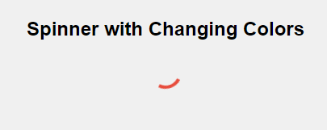

# Spinner with Changing Colors Animation




This project demonstrates a simple page loading animation using CSS only. It includes a centered block with a loading animation and a title.

## Features

- **Title:** Displayed at the top of the page.
- **Loading Animation:** A loading animation in the center of the page.
- **Responsive Design:** Centered content adjusts based on screen size.

## How to Use

1. Clone the repository: `https://github.com/coderooz/Spinner-with-Changing-Colors-Animation`
2. Open `index.html` in a web browser.


### Project Structure

```
project-folder/
│
├── index.html
├── style.css
└── README.md
```

## Credits

- CSS Loading animation inspired by various online examples.
- Designed and implemented by Coderooz [Ranit Saha].

## License

This project is licensed under the MIT License - see the LICENSE file for details.
